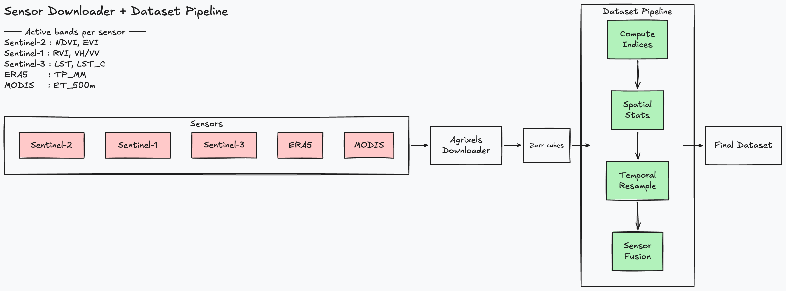
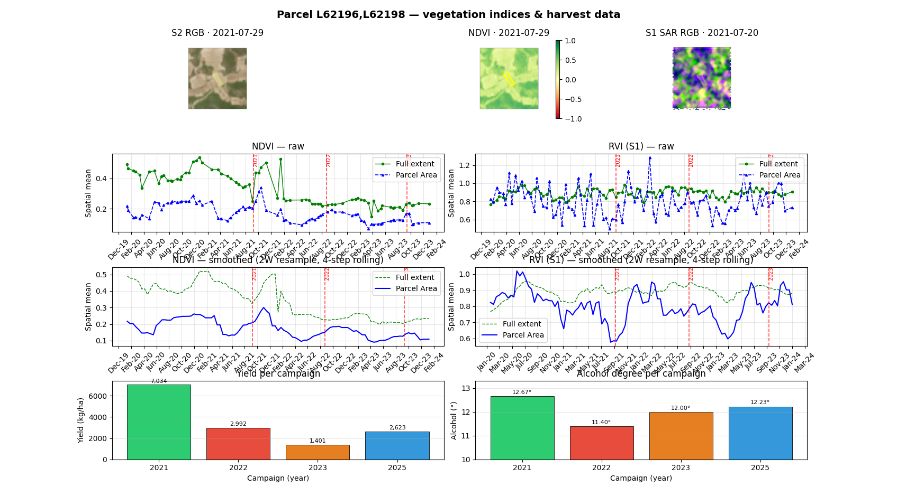
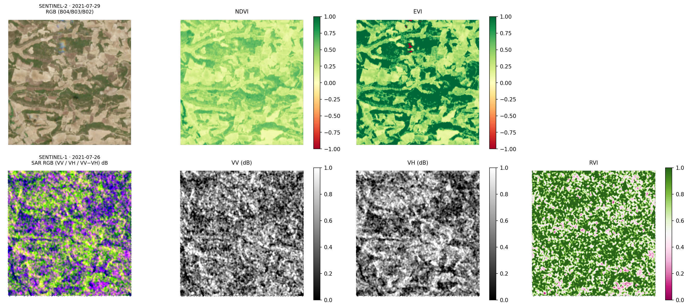
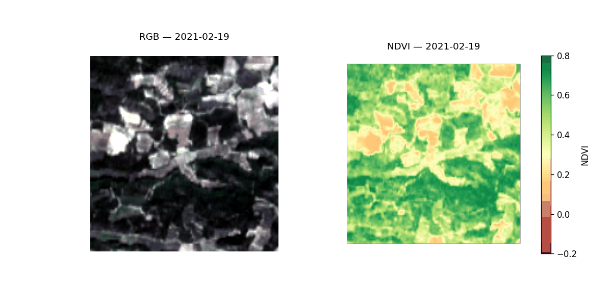
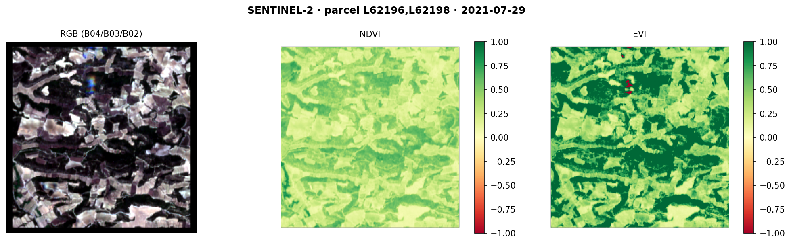
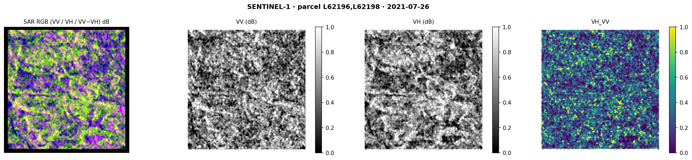

# AI Vineyard Productivity

Research project for a TFM (Trabajo Fin de Máster) on vineyard productivity analysis using multi-sensor satellite imagery. The pipeline ingests Sentinel-1, Sentinel-2, and Sentinel-3 data stored as Zarr cubes, computes spectral and radar indices, and extracts per-parcel temporal statistics for yield modeling.




## Overview



The dataset module builds a tabular feature set from satellite image cubes. For each parcel and sensor, it:

1. Loads a `(time, variable, y, x)` xarray Dataset from a Zarr store.
2. Applies sensor-specific preprocessing (e.g. SAR calibration and speckle filtering for Sentinel-1).
3. Computes spectral or radar indices and appends them as new bands.
4. Spatially aggregates each band over the parcel geometry into scalar statistics per timestep.

The output is a `pandas.DataFrame` with one row per timestamp, suitable for downstream regression or classification models.

## Sensors and Indices

**Sentinel-2** (optical)
- NDVI — Normalized Difference Vegetation Index
- EVI — Enhanced Vegetation Index
- SAVI — Soil Adjusted Vegetation Index
- NBR2 — Normalized Burn Ratio 2
- NDWI — Normalized Difference Water Index

**Sentinel-1** (SAR)
- Preprocessing: DN to sigma0 calibration, median speckle filter, conversion to dB
- RVI — Radar Vegetation Index
- VH_VV — VH/VV backscatter ratio
- DpRVI — Dual-pol Radar Vegetation Index

**Sentinel-3 SLSTR** (thermal)
- LST_C — Land Surface Temperature in Celsius

## Dataset Examples

Sentinel-2 temporal evolution (RGB and NDVI):



Sentinel-2 snapshot — parcel L62196,L62198 (2021-07-29):



Sentinel-1 snapshot — parcel L62196,L62198 (2021-07-26):



## Data Layout

Zarr stores are expected at:

```
{base_path}/{SENSOR}/{parcel_key}/cube.zarr
```

where `SENSOR` is one of `SENTINEL-1`, `SENTINEL-2`, or `SENTINEL-3`.

## Usage

```python
from src.dataset.pipeline import make_pipeline

pipeline = make_pipeline(base_path="data/agrixel_output")

df = pipeline.execute(
    parcel_keys=["L62196,L62198"],
    sensors=["SENTINEL-2", "SENTINEL-1"],
)
```

To configure indices and output bands via YAML:

```python
from src.dataset.pipeline import make_pipeline_from_config

pipeline = make_pipeline_from_config(
    base_path="data/agrixel_output",
    config="config/dataset.yaml",
)
```

Example YAML config:

```yaml
stats: [mean, std, median]
sensors:
  SENTINEL-2:
    compute_indices: [NDVI, EVI, SAVI]
    output_bands: [B04, B08, NDVI, EVI, SAVI]
  SENTINEL-1:
    compute_indices: [RVI, DpRVI]
    output_bands: [VV, VH, RVI, DpRVI]
```

Available statistics: `mean`, `std`, `median`, `p25`, `p75`, `min`, `max`.

## Setup

Requires Python 3.12. Dependencies are managed with `uv`.

```bash
uv sync
```

Run linting:

```bash
uv run ruff check
uv run ruff format
```
